<div align="center">

#  </img> VRCXM

**A fork of [VRCX](https://github.com/vrcx-team/VRCX) with a modern dark theme redesign and enhanced features.**

[](https://github.com/naiolune/VRCXM/releases/latest)
[](https://github.com/naiolune/VRCXM/releases/latest)
[](https://github.com/naiolune/VRCXM/actions/workflows/github_actions.yml)
[](https://vrcx.app/discord)

| **English** | [Français](./README/README.fr.md) | [日本語](./README/README.jp.md) | [简体中文](./README/README.zh_CN.md) | [Italiano](./README/README.it.md) | [Русский](./README/README.ru_RU.md) | [Español](./README/README.es.md) | [Polski](./README/README.pl.md) | [ภาษาไทย](./README/README.th.md)

VRCXM is a fork of VRCX, an assistant/companion application for VRChat that provides information about and helps you accomplish various things related to VRChat in a more convenient fashion than relying on the plain VRChat client (desktop or VR), or website alone. This fork features a complete redesign with a modern dark theme and additional features while maintaining 1:1 functionality with the original VRCX.

# Getting Started

<div align="center">

**Windows installers are provided for easy installation. No need to build from source!**

- **Windows**: Download `VRCXM_Setup_[version].exe` from the [latest release](https://github.com/naiolune/VRCXM/releases/latest)
- **Linux/macOS**: Must be built from source (see [Building from source](#building-from-source) below)

Original VRCX installer (`VRCX_Setup.exe`) available [here](https://github.com/vrcx-team/VRCX/releases/latest).

# Features

<div align="left">

- :family: Friend, world, and avatar list management
    - Manage your friends list, world/group/avatar lists outside of VRChat.
    - Monitor the world/avatar activity of your friends and check their online status.
    - Keep track of when you first added them and when you last saw them.
    - See how much time you've spent together in worlds and how many times.
    - Keep track of friend name changes.
    - Save notes to help remember how you met.
- :electric_plug: Automatically launch apps when you start VRChat
    - You can configure VRCX to launch other apps when you start VRChat.
    - For example, you could have VRCX launch an OSC app or a voice changer app when VRChat opens up.
- :mag: Search for avatars, users, worlds, and groups
- :earth_americas: Build a local, unrestricted world favorites list
- :camera: Store world data in the pictures you take in-game, so you can remember that one world you took those cool pictures in like... 6 months ago!
- :bell: Monitor/respond to notifications
    - You can send/receive invites and friend requests from VRCX as well as see the instance info of invites that you receive.
- :scroll: See stats/players for your current instance
- :tv: See the links to videos and that are playing in the world you're in, as well as various other logged data.
- :bar_chart: Improved Discord Rich Presence
    - You can optionally display more information about your current instance in Discord.
    - World integration for popular worlds like Popcorn Palace, PyPyDance, VRDancing and LSMedia.
    - This includes the world thumbnail, name, instance ID, and player count, depending on your settings and whether the lobby is private. You can also add a join button for public lobbies!
- :crystal_ball: VR Overlay with configurable live feed of all supported events/notifications
- :outbox_tray: Upload avatar/world images without Unity
- :page_facing_up: Manage and edit uploaded avatar/world details without Unity
- :skull: Automatically restart and join last instance when VRC crashes
- :left_right_arrow: Export/import favorite groups

## Building from source

**Note:** Windows installers are provided in the [releases](https://github.com/naiolune/VRCXM/releases/latest). Linux and macOS users must build from source.

If you want to build VRCXM from source (for Linux/macOS or for development/customization), see the original VRCX [Building from source](https://github.com/vrcx-team/VRCX/wiki/Building-from-source) guide for instructions. The build process is identical to VRCX.

### Quick Build Instructions

1. **Prerequisites:**
    - Node.js (v18 or later)
    - .NET SDK (for Electron backend)
    - Git

2. **Clone and install:**

    ```bash
    git clone https://github.com/naiolune/VRCXM.git
    cd VRCXM
    npm install
    ```

3. **Build:**

    ```bash
    # Build frontend
    npm run prod

    # Build Electron app with installer (Windows)
    npm run build-electron

    # Build for Linux
    npm run build-electron -- --linux

    # Build for macOS
    npm run build-electron -- --mac
    ```

The built installer will be in the `build` directory.

## Migrating from VRCX

VRCXM uses a separate data folder (`VRCXM`) to avoid conflicts with the original VRCX. If you want to migrate your existing VRCX data (friends, feed history, favorites, etc.) to VRCXM, follow these steps:

### Windows

1. **Close both VRCX and VRCXM** if they are running.

2. **Locate your VRCX data folder:**
    - Press `Win + R` to open the Run dialog
    - Type `%APPDATA%\VRCX` and press Enter
    - This will open the VRCX data folder in File Explorer

3. **Locate your VRCXM data folder:**
    - Press `Win + R` to open the Run dialog
    - Type `%APPDATA%\VRCXM` and press Enter
    - This will open the VRCXM data folder in File Explorer
    - If the folder doesn't exist yet, run VRCXM once to create it

4. **Copy the database files:**
    - From the VRCX folder, copy the following files to the VRCXM folder:
        - `VRCX.db` (main database file)
        - Any other `.db` files you see
    - **Important:** Do not copy files while VRCX or VRCXM is running, as this may corrupt the database.

5. **Copy configuration files (optional):**
    - Copy `config.json` if you want to preserve your VRCX settings
    - Note: Some settings may need to be reconfigured due to differences between VRCX and VRCXM

6. **Start VRCXM** and verify your data has been migrated successfully.

### Linux / macOS

1. **Close both VRCX and VRCXM** if they are running.

2. **Locate your VRCX data folder:**
    - Linux: `~/.config/VRCX/`
    - macOS: `~/Library/Application Support/VRCX/`

3. **Locate your VRCXM data folder:**
    - Linux: `~/.config/VRCXM/`
    - macOS: `~/Library/Application Support/VRCXM/`
    - If the folder doesn't exist yet, run VRCXM once to create it

4. **Copy the database files:**

    ```bash
    # Linux
    cp ~/.config/VRCX/*.db ~/.config/VRCXM/

    # macOS
    cp ~/Library/Application\ Support/VRCX/*.db ~/Library/Application\ Support/VRCXM/
    ```

5. **Copy configuration files (optional):**

    ```bash
    # Linux
    cp ~/.config/VRCX/config.json ~/.config/VRCXM/

    # macOS
    cp ~/Library/Application\ Support/VRCX/config.json ~/Library/Application\ Support/VRCXM/
    ```

6. **Start VRCXM** and verify your data has been migrated successfully.

### Important Notes

- **Backup first:** Always make a backup of your VRCX data folder before copying files.
- **One-way migration:** This is a one-time copy operation. After migration, VRCX and VRCXM will maintain separate databases.
- **Analytics migration:** After copying your data, you may need to run the Analytics migration in VRCXM to process historical data for the analytics features. See the Analytics page in VRCXM for more information.

## Differences from VRCX

- **Modern Dark Theme**: Complete visual redesign with a beautiful dark aesthetic
- **Advanced Feed Filters**: Date range filtering and enhanced tag/type filters for the activity feed
- **Hide Friends from Feed**: Option to hide specific friends from the activity feed while still tracking their data
- **Analytics Dashboard**: Comprehensive analytics page with:
    - Activity Analytics: Time spent per world/avatar breakdown
    - Social Statistics: Most active friends ranking
    - World & Avatar Analytics: Most visited worlds and avatar usage statistics
- **Performance Settings**: Configurable max table size for feed and game log queries
- **Separate App Data**: Uses `VRCXM` folder instead of `VRCX`
- **All original VRCX functionality preserved**: 1:1 feature parity with the original

## Maintainer

VRCXM is maintained by [naiolune](https://github.com/naiolune).

Original VRCX is developed by [pypy](https://github.com/pypy-vrc) and [Natsumi](https://github.com/Natsumi-sama).

## Original VRCX Resources

- Want a new look for VRCX? Check out [Themes](https://github.com/vrcx-team/VRCX/wiki/Themes)
- See [Building from source](https://github.com/vrcx-team/VRCX/wiki/Building-from-source) for instructions on how to build VRCX from source.
- For a guide on how to run VRCX on linux, see [here](https://github.com/vrcx-team/VRCX/wiki/Running-VRCX-on-Linux)

# Screenshots

<div align="center">

<h3>Login</h3>

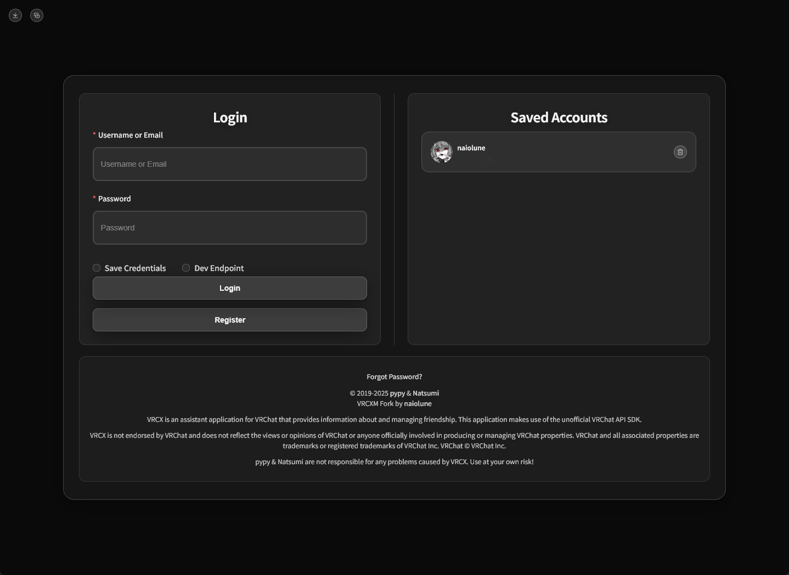

<h3>Feed</h3>

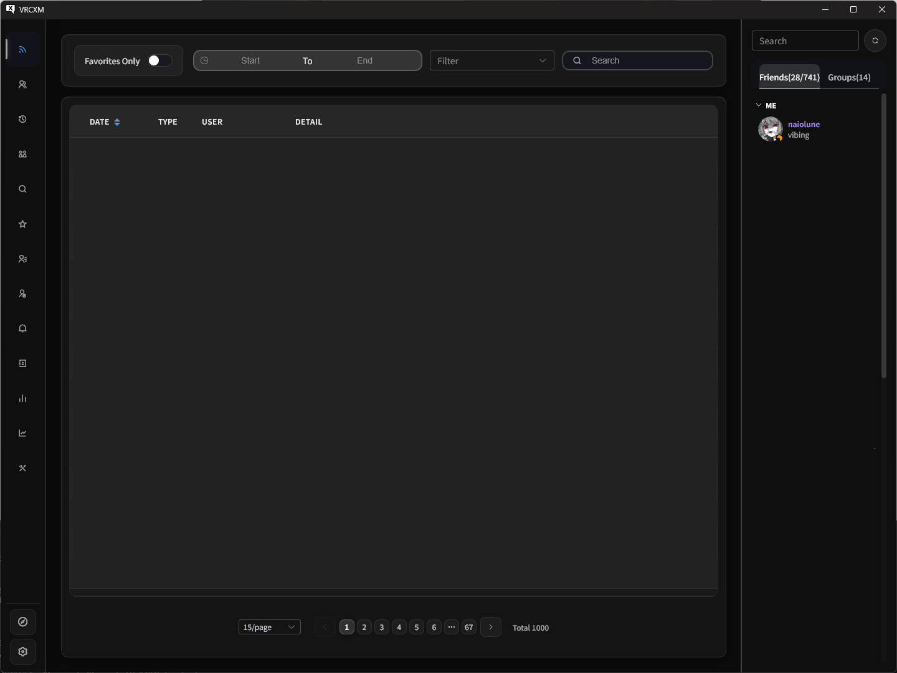

<h3>GameLog</h3>

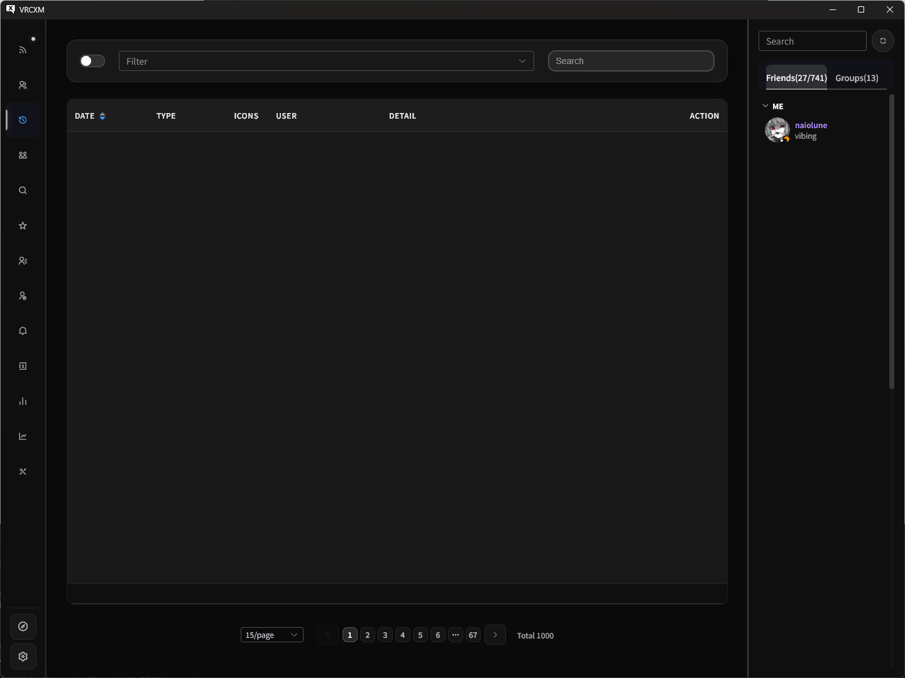

<h3>UserInfo</h3>

<table>
  <tr>
    <td align="center">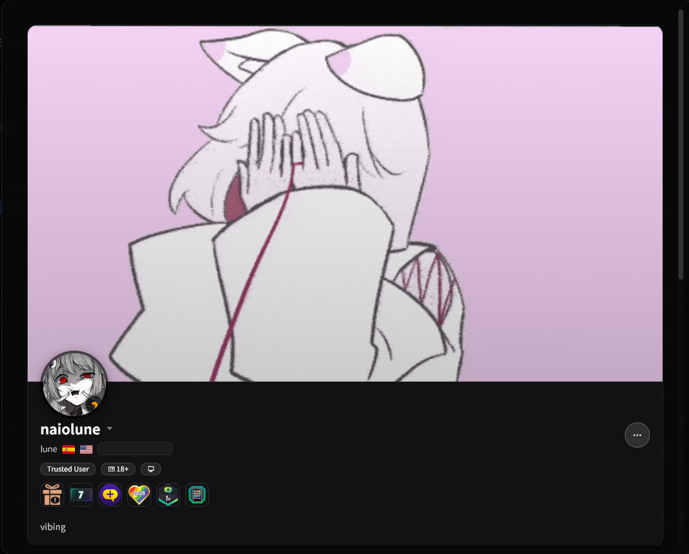</td>
    <td align="center">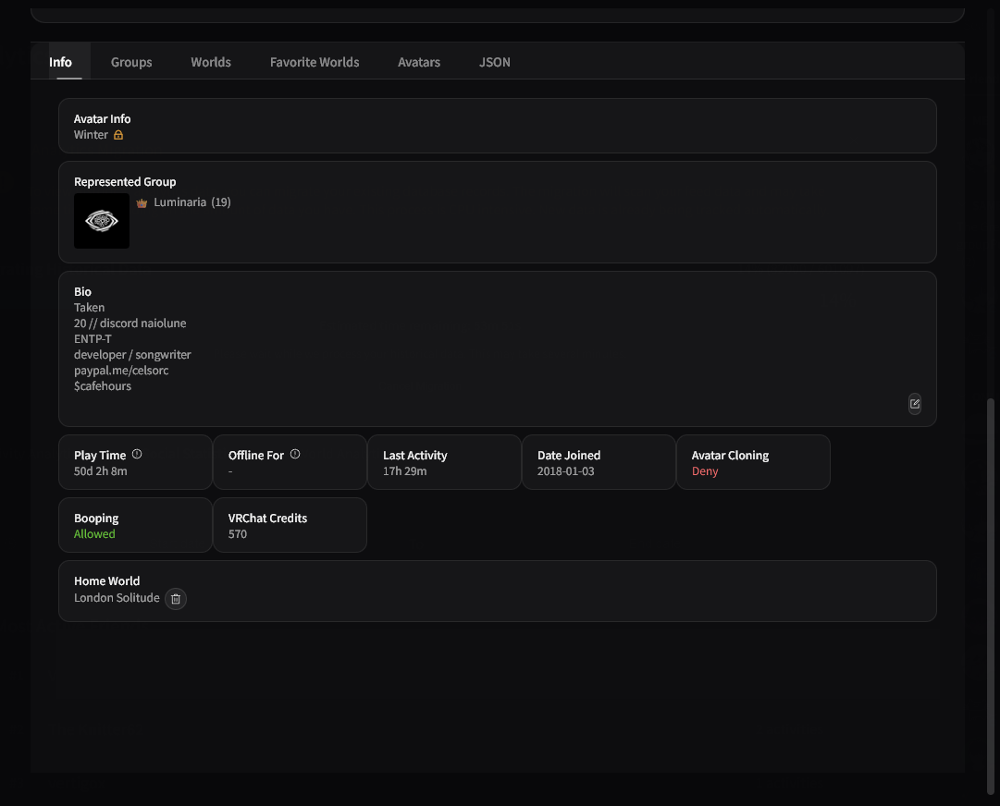</td>
  </tr>
</table>

<h3>World</h3>

<table>
  <tr>
    <td align="center">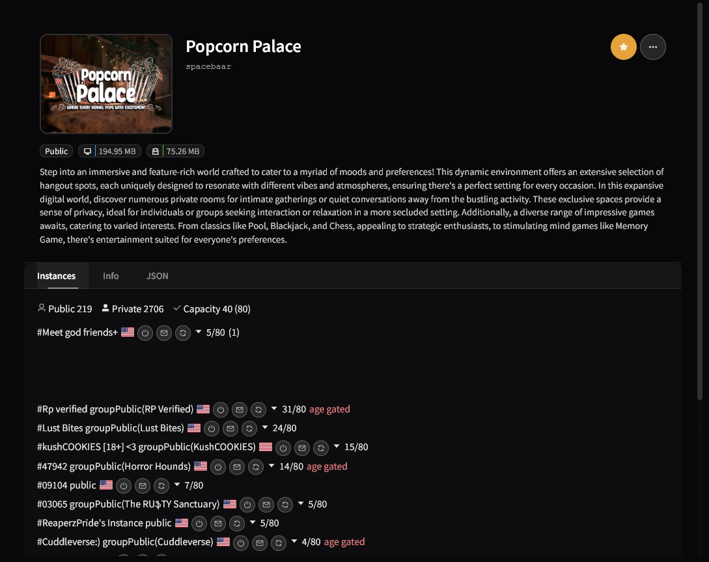</td>
    <td align="center">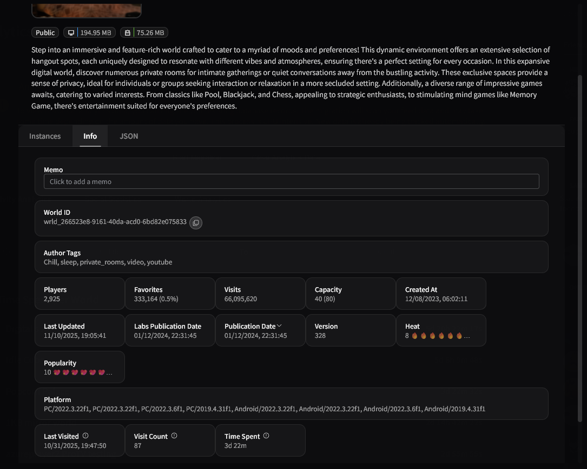</td>
  </tr>
</table>

<h3>Favorite</h3>

<h4>Friend</h4>

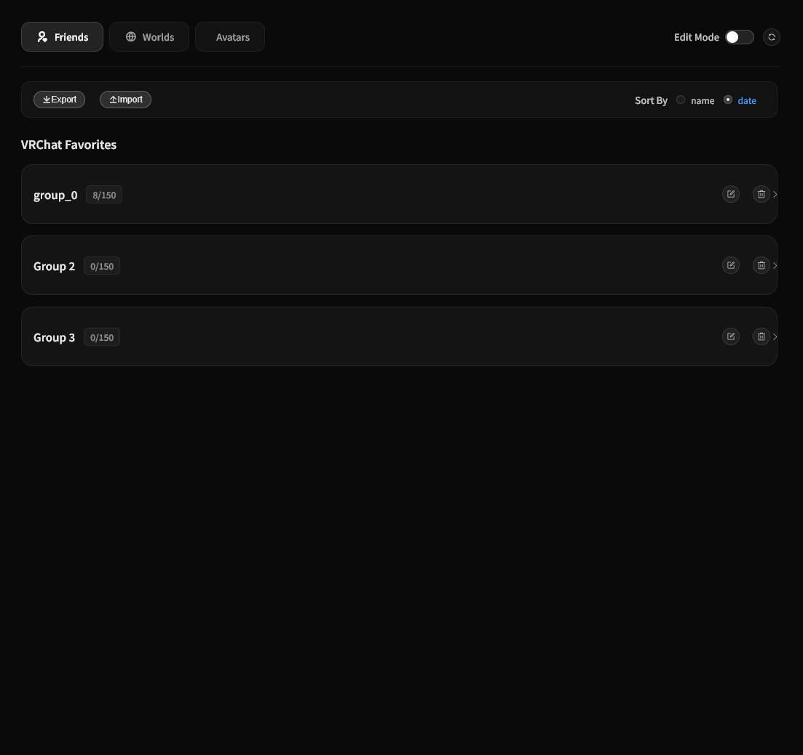

<h4>World</h4>

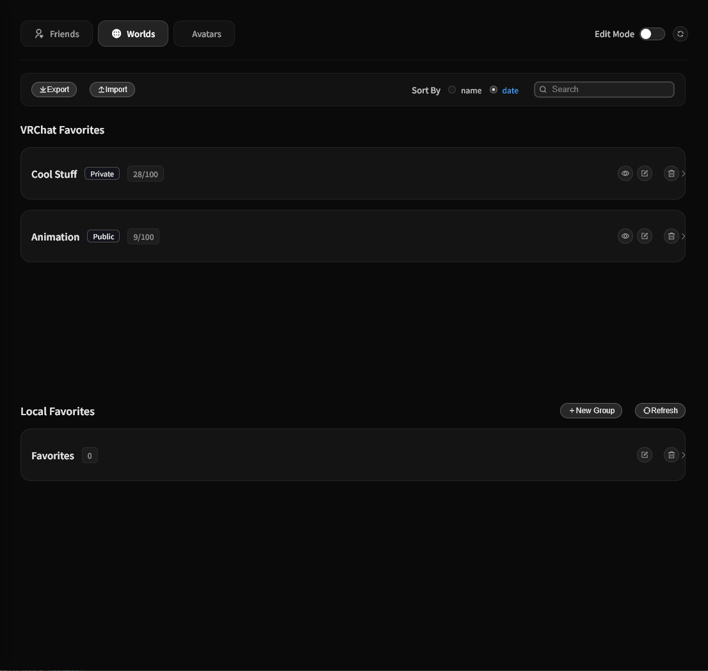

<h4>Avatar</h4>

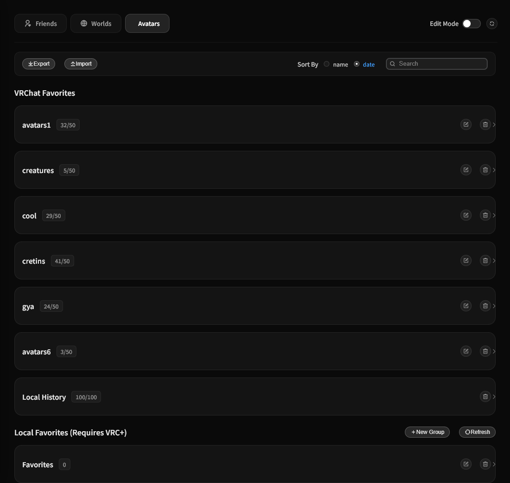

<h3>Friend Log</h3>

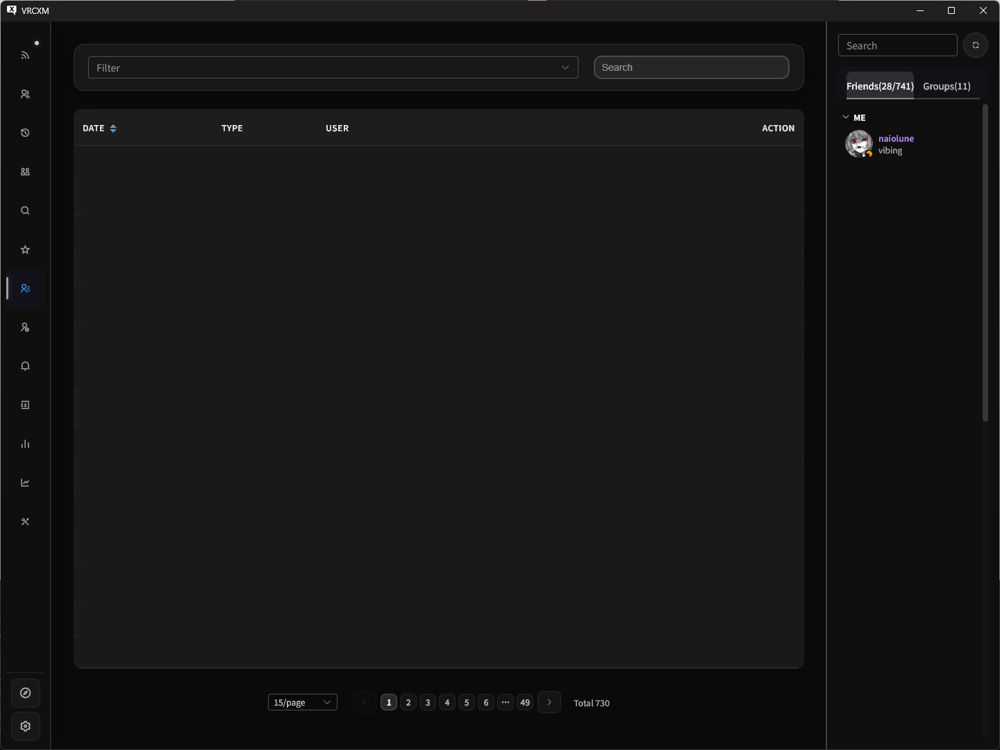

<h3>Discord Rich Presence</h3>


</div>

## Is VRCXM against VRChat's TOS?

**No.**

VRCXM (like VRCX) is an external tool that uses the VRChat API to provide the features it does.

It does not modify the game in any way, only using the API responsibly to provide the features it does. It is not a mod, or a cheat, or any other form of modification to the game.

To see VRChat's stance on API usage, see the #faq channel in the VRChat Discord.

---

VRCXM is not endorsed by VRChat and does not reflect the views or opinions of VRChat or anyone officially involved in producing or managing VRChat properties. VRChat and all associated properties are trademarks or registered trademarks of VRChat Inc. VRChat © VRChat Inc.

VRCXM is a fork of [VRCX](https://github.com/vrcx-team/VRCX) and is not affiliated with the VRCX team.
